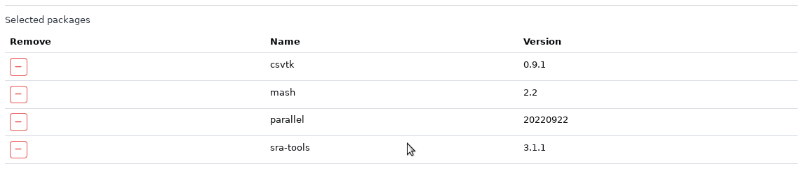

## Section 1: Start your VM

This part shows you how to start a VM

### 1.1 Create a de.NBI Cloud Account and register for the SimpleVM project

If you do not have a de.NBI Cloud account, please register for one
via this link: https://cloud.denbi.de/register.
You can read more about the registration process in our 
de.NBI Cloud wiki: https://cloud.denbi.de/wiki/registration/.
Please make sure to to click on “continue” if this button shows up.

Once you obtain a de.NBI Cloud account, please register for the SimpleVM project:
https://cloud.denbi.de/tdf

The workshop organizers will approve your project membership application as soon as possible.
If you are successfully registered for a de.NBI Cloud account,
you should be able to log in to the de.NBI Cloud Portal: https://cloud.denbi.de/portal/.

### 1.2 Select the SimpleVMTest1 project

You start this tutorial from your profile page (https://simplevm.denbi.de).

1. Click on the `New Instance` tab.

2. If you are already member of a SimpleVM project then you are offered a drop down menu to select
a project. In this case please select the **SimpleVMTest1** project. If this is
your first SimpleVM project, you are now able to select/generate a key (next point) or directly start a VM.

3. If you have no SSH key set so far, just click on generate key and save the
private key. During this workshop you will not need this file because 
you will access all VMs via the browser. However, for your future work using
SimpleVM, we highly recommend to read our de.NBI Cloud wiki regarding
SSH keys: https://cloud.denbi.de/wiki/portal/user_information/#ssh-key

### 1.3 Start a VM

1. Choose a name for your VM.
2. Select **de.NBI medium**.
3. In the image section, please click on the *Research Environments* tab 
   and select the **Visual Sudio Code** image based on **Ubuntu 24.04**.
   
4. Select the Conda tab and choose the following tools with their version numbers given below for installation via Conda:
   * s5cmd (2.0.0)
   * parallel (20220922)
   * seqkit (2.9.0)
   * sra-tools (3.1.1)
   
   
   You will learn in the next sections how to apply these tools.

5. Optional: Modify the URL path for VSCode. You will access VSCode via this URL.
   
6. Grant access to the workshop organizers (Peter Belmann, Sebastian Jünemann).
   This way these members get ssh access to your VM and can help you in case
   something does not work as expected.
7. Confirm the checkboxes and click on Start.

Next to [Section 2](part2.md)
