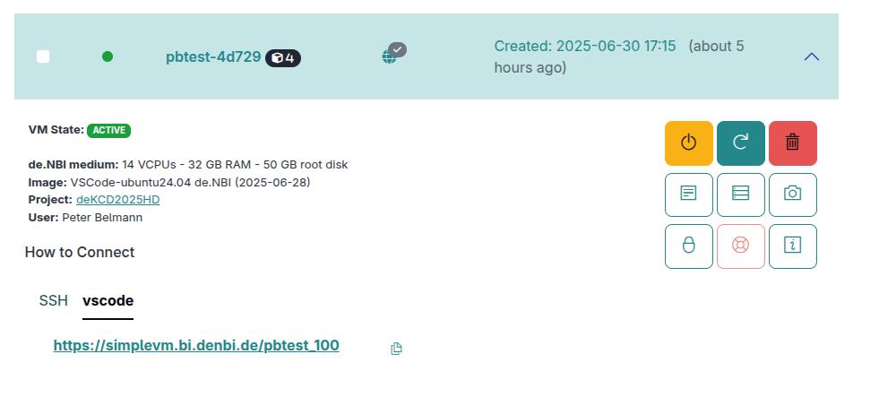

## Section 2: Verify your VM properties and tools

After the start of the machine has been triggered, some time may pass before the machine is available.
As soon as this is the case, this becomes visible via a green icon.

Once the VM is available, you can use it for testing the tools and inspecting the data before
you start with your analysis in the next section.

### 2.1 Check your VM

Log in to the VM and verify that SimpleVM provisioned the VM correctly.

1. After you have initiated the start-up of the machine, you should have been automatically redirected to the **Instance Overview** page. Now click on the dropdown of your machine. 
   Click on the VSCode URL which opens a new browser tab.
   
2. Click on the sandwich button in the upper left menu and select `Terminal` and `New Terminal`.
   
3. Inspect the VM before starting to work with it. Let's check whether the VM
   has the properties that SimpleVM promised you by typing the following commands
   in your newly opened terminal window.
   `nproc` tells you the number of processing units.
   ```
   nproc
   ```
   Does that correspond to the actual number of cores of the flavor you selected?
   `free -h` tells you the amount of RAM that is available to your VM. You will see
   that the sum of the total amount of Mem (`total` column, `Mem` row) corresponds 
   roughly to the RAM size of your selected flavor.
   ```
   free -h
   ```
   You can also check what kind of processes are running on your VM by executing `top`
   or `htop`.
   ```
   htop
   ```
   Exit `htop` by typing `q` or `F10`.

4. You can use the tools you selected in the previous part by running `conda activate denbi`.

5. Test if the needed commands are installed by running all of them with -h parameter.
   You will get an explanation of their usage in the next chapter.

   * `mash -h`
   * `parallel -h`
   * `csvtk -h`
   
   If there is an error reported, then something went wrong, and we have to either
   repeat the conda installation manually or install it a different way.

6. Remember that you have root permissions on the VM. You can install any
   tool that you need for your research.
   Let's test this statement by first fetching the latest information about available packages and installing the following commands (`fortune-mod`, `cowsay`) via `sudo`.

   Update:
   ```
   sudo apt update
   ```

   Install the commands:
   ```
   sudo apt install -y fortune-mod cowsay
   ```
   You can run both commands via
   ```
   /usr/games/fortune | /usr/games/cowsay 
   ```

Back to [Section 1](part1.md) | Next to [Section 3](part3.md)
