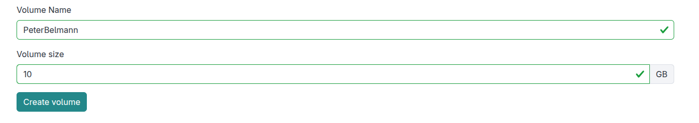

## Section 3: Basic data management in the cloud

Once your cumpute environment is set up, the question is how access your data
for your analysis. In this short section we want to load some external data into
our virtual environment. Further, we will also search for more metagenomic
datasets via object storage.

### 3.1 Create a volume to store data in

1. Inspect what block storage is available on your virtual instance by typing:
   ```
   df -h 
   ```
3. In the SimpleVM portal, navigate to the Volumes section and create a volume for your VM.
   Enter your name without whitespace (Example: Max Mustermann -> MaxMusterman) as the volume name 
   and provide 10 GB as the volume size.
   

4. Attach this volume to your instance by opening the pull down menu of your volume and
   clicking the green attach icon. Then select you virtual machine in the pop up menu and
   click the attach button.
   

5. Activate the newly created and attached volume in your VM:
   ```
   lsblk
   sudo mkfs.ext4 /dev/vdc
   sudo mkdir /mnt/volume   
   sudo mount /dev/vdc /mnt/volume
   sudo chown ubuntu:ubuntu /mnt/volume
   lsblk   
   ```
6. Navigate to the newly created volume and activate the conda environment:
   ```
   cd /mnt/volume
   conda activate denbi
   ```
### 3.1 Public available data

In our use case, we want to search for some pathogenic factors in metagenomic data.
Metagenomic data is public available e.g. in the Short Read Archive (SRA) hosted by the
National Center for Biotechnology Information. We can search here for specific data sets, e.g.
for metagenomic data that were generated with a specific sequencing instrument for e specific 
type of experiment.

1. Go to:
   https://www.ncbi.nlm.nih.gov/sra
2. And enter in the search fild the following search pattern:
   ```
   blood culture AND ((((((Oxford Nanopore[Platform]) AND METAGENOMIC[Source]) AND WGS[Strategy]) AND SINGLE[Layout]) AND RANDOM[Selection]))
   ```
3. Let's have a look on (one of) the first result:
   https://www.ncbi.nlm.nih.gov/sra/?term=SRR24962458

4. These data sets can be downloaded in different ways, e.g. using the public available
   FTP server:
   ```
   ftp ftp://ftp.sra.ebi.ac.uk/vol1/srr/SRR249/058/SRR24962458/SRR24962458
   ```
5. This data is still in a special format that needs to be converted in order to be inspected
   for specific virulence factors:
   ```
   fasterq-dump --skip-technical SRR24962458
   ```
6. We will also download a sequence information of known pathogens. We created a mash index out of selected genomes
   that were classified as  "greatest threat to human health" by the World Health Organisation (WHO) in 2017:
   https://www.who.int/news/item/27-02-2017-who-publishes-list-of-bacteria-for-which-new-antibiotics-are-urgently-needed 
   Please download the index:
   ```
   wget https://openstack.cebitec.uni-bielefeld.de:8080/simplevm-workshop/genomes.msh
   ```
7. Now we will screen the metagenomic data for parts of sequences belongig to those known pathogens:
   ```
   mash screen -p 12 genomes.msh SRR24962458.fastq
   ```   
### 3.2 Cloud enabled data

Using FTP for file transfer is not the ideal choice, as it lacks features such as encryption, compression,
and error checking, making it slower and less secure than alternative protocols. In cloud environments,
the S3 protocol has become a de facto standard because it offers high-performance, secure, and reliable object
storage with built-in features such as versioning, bucket policies, and multi-part uploads, making it well-suited
for big data transfer and analytics workloads. For this reason, many scientific important data is already provided in 
some cloud object storage, for instance at the AWS cloud by Amazon.

However for operating on large datasets, accessing remote storage can be a bottle neck. For this reason, one of the cloud 
paradigms is called Data Gravity: The idea that data is a massive attractor and should be processed as close to
its source as possible, reducing the need for expensive data movement. For this reason, the de.NBI Cloud at Bielefeld
site holds a mirror of all metagenomic data of the SRA that we will use now.
   
1. Click on `Terminal` in the upper menu and select `New Terminal`.
   

2. Activate the conda environment by running:
   ```   
   conda activate denbi
   cd /mnt/volume   
   ```
3. Add S3 config for our public SRA mirror on our Bielefeld Cloud site:
   ```
   mc config host add sra https://openstack.cebitec.uni-bielefeld.de:8080 "" ""
   ```

4. List which files are available for a specific SRA number, e.g. for `SRR3984908`:
   ```
   mc ls sra/ftp.era.ebi.ac.uk/vol1/fastq/SRR398/008/SRR3984908
   ```

5. Check the size of these files
   ```
   mc du sra/ftp.era.ebi.ac.uk/vol1/fastq/SRR398/008/SRR3984908
   ```

6. You can read the first lines of these files by using `mc cat`.
   ```
   mc cat sra/ftp.era.ebi.ac.uk/vol1/fastq/SRR398/008/SRR3984908/SRR3984908_1.fastq.gz | zcat | head
   ```
7. We created a file that points to metagenomic datasets that you have found in the previous chapter.
   Download the input file via:
   ```
   wget https://openstack.cebitec.uni-bielefeld.de:8080/simplevm-workshop/reads.tsv
   ```
   You can inspect the file by using `cat`:
   ```
   cat reads.tsv
   ```
3. We will create a directory for the output for the following command. We will place an output
   file for every SRA ID.
   ```
   mkdir -p output
   ```

4. You can now run the commands from the first part with found datasets as input (this may take a while to complete):
   Create a function that we will run in prallel:
   ```
   search(){ 
      left_read=$(echo $1 | cut -d ' '  -f 1);  
      right_read=$(echo $1 | cut -d ' ' -f 2); 
      sra_id=$(echo ${left_read} | rev | cut -d '/' -f 1 | rev | cut -d '_' -f 1 | cut -d '.' -f 1);
      mc cat $left_read $right_read | mash screen -p 3 genomes.msh - \
          | sed "s/^/${sra_id}\t/g"  \
          | sed 's/\//\t/' > output/${sra_id}.txt ;
   }
   ```
   <details><summary>Show Explanation</summary>
   In order to understand what this function does let's take the following datasets as an example:
   <code>
   sra/ftp.era.ebi.ac.uk/vol1/fastq/SRR643/001/SRR6439511/SRR6439511_1.fastq.gz    sra/ftp.era.ebi.ac.uk/vol1/fastq/SRR643/001/SRR6439511/SRR6439511_2.fastq.gz
   </code>
   where
      
    * `left_read` is left file (`sra/ftp.era.ebi.ac.uk/vol1/fastq/SRR643/001/SRR6439511/SRR6439511_1.fastq.gz`)
    * `right_read` is the right file (`sra/ftp.era.ebi.ac.uk/vol1/fastq/SRR643/001/SRR6439511/SRR6439511_2.fastq.gz`)
    * `sra_id` is the prefix of the file name (`SRR6439511`)
    * `mc cat` streams the files into `mash screen` which is using the sketched genomes `genomes.msh`
       to filter the datasets.
    * Both `sed`s are just post-processing the output and place every match in the `output` folder.

   </details>
   
   Export this function, so that we can use it in the next command.
   ```
   export -f search
   ```
   We can run this function now on the dat sets that are defined in the reads.tsv list in parallel:
   ```
   parallel -a reads.tsv search
   ```
   where
     * `reads.tsv` is a list of datasets that we want to scan.
     * `search` is the function that we want to call.

5. Optional: This command will run a few minutes. You could open a second terminal
   and inspect the cpu utilization with `htop`.
   

6. Concatenate all results into one file via 
   ```
   cat output/*.txt > output.tsv
   ```
7. Let's plot how many matched k-mer hashes we have found (from 0 to 1000):
   ```
   csvtk -t plot hist -H -f 3 output.tsv -o output.png
   ```
   You can open this file by a click on the Explorer View and selecting the pdf.

   We can also plot the number of found hashes for each of the found pathogens:
   ```
   csvtk -t plot box -H -g 7 -f 3 output.tsv --horiz -o output_box.png
   ```
   
Back to [Section 2](part2.md) 
